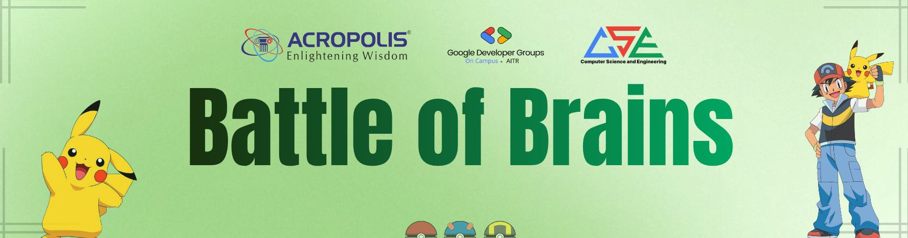

# Battle of Brains

Solutions for the 90-minute DSA contest organized by GDGoC AITR.

This repository is arranged year-wise. Each folder contains Markdown solution files, and each file name matches the corresponding problem statement.

## Solutions

### 1st Year

- [Drone Camera Reorientation](./1st_Year/Drone_Camera_Reorientation.md)
- [Secure Number Validation](./1st_Year/Secure_Number_Validation.md)
- [Signal State Decoder](./1st_Year/Signal_State_Decoder.md)
- [The Missing ID](./1st_Year/The_Missing_ID.md)

### 2nd Year

- [Neon Arcade](./2nd_Year/Neon_Arcade.md)
- [Palindromic Passage](./2nd_Year/Palindromic_Passage.md)
- [The Hidden Payload](./2nd_Year/The_Hidden_Payload.md)
- [The Wavefront Scheduling](./2nd_Year/The_Wavefront_Scheduling.md)

### 3rd Year

- [Chalkboard Reduction Game](./3rd_year/Chalkboard_Reduction_Game.md)
- [Signal Recovery Window](./3rd_year/Signal_Recovery_Window.md)
- [The Circular Rally](./3rd_year/The_Circular_Rally.md)
- [The Kingdom of Mirrors](./3rd_year/The_Kingdom_of_Mirrors.md)

## GDGoC-AITR

Stay connected with GDGoC AITR:

- [GDG on Campus AITR Community Page](https://gdg.community.dev/gdg-on-campus-acropolis-institute-of-technology-research-indore-india/)
- [Instagram](https://www.instagram.com/gdgoc.aitr/)
- [LinkedIn](https://www.linkedin.com/company/gdscaitr/posts/)